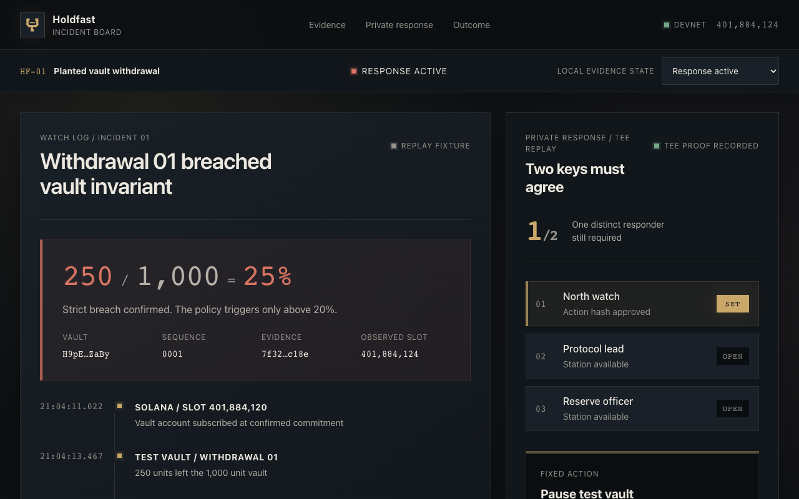

# Holdfast

Holdfast is a private two-of-three circuit breaker for small Solana protocol
teams. A detector observes a planted vault withdrawal above 20% of recorded
TVL, opens one incident, and alerts responders. Approvals happen in a
permissioned MagicBlock Ephemeral Rollup; quorum commits to Solana and schedules
a Magic Action that pauses the separate vault program.

The detector cannot pause the vault. One responder cannot pause it either.

- [Open the live incident board](https://yonkoo11.github.io/holdfast/)
- [Watch the 90-second demo](https://yonkoo11.github.io/holdfast/holdfast-demo.mp4)
- [Inspect the public repository](https://github.com/Yonkoo11/holdfast)



## Quick start

Requirements: Node.js 22+, Rust, Solana CLI, Anchor 0.32.1, and the toolchain
needed by `anchor build`.

```bash
npm install
npm run dev
npx tsc --noEmit
npm test
./verify.sh phase-0
./verify.sh phase-1
./verify.sh phase-2
./verify.sh phase-3
./verify.sh phase-4
./verify.sh final
```

The Phase 0 scripts use MagicBlock and Solana devnet, create funded fixture
accounts, and perform on-chain writes. Run them only with an intentionally
configured devnet wallet. Phases 1-3 otherwise run deterministic local tests.

## Architecture

- `programs/test-vault`: deliberately small monitored vault with a constrained pause authority.
- `programs/holdfast`: evidence, private approval state, commit scheduling, and one-use receipt.
- `services/detector`: account subscription, breach evaluation, persistence, incident opening, and alerts.
- `app`: responsive incident board with injected-wallet connection and wallet-free Devnet proof.
- `tests`: local behavioral tests and explicit live devnet spikes.
- `reports/magicblock-integration.md`: transaction-backed evidence and observed failure semantics.

Deployed devnet programs:

- Holdfast: `EjU7sFMStj15r1NVrzgVbRJBdjUTUGbgyzHvFzEaaZuz`
- Test vault: `H9pEwKaL9JwCjYj1ZgmVbZ6AAHHRyXMd4HZfSi1GZaBy`

The operator board starts in an explicit local incident replay. Its **Verify
Devnet proof** control needs no wallet: it reads the deployed action receipt and
test vault through MagicBlock Devnet, validates their owners and Anchor account
layouts, and reports containment only when the receipt is executed and the
vault is paused for the same incident.

## Reproduce the detector path

`npm run test:detector` proves the strict threshold boundary, evidence
reconstruction, one-incident behavior, restart-safe delivery, PDA derivation,
webhook contract, and under-ten-second acceptance bound using an injected test
clock. That timing result is deterministic service evidence, not a fresh
public-RPC latency benchmark. The devnet spikes separately prove privacy,
two-responder containment, and failed-action reconciliation.

## Run the detector

The service uses Anchor's standard provider configuration and intentionally has
no embedded wallet, RPC, webhook, or vault defaults:

```bash
export ANCHOR_PROVIDER_URL="https://your-devnet-rpc"
export ANCHOR_WALLET="/path/to/a/dedicated-devnet-wallet.json"
export HOLDFAST_VAULT="your-test-vault-account"
export HOLDFAST_CONTROLLER="its-holdfast-controller-pda"
export HOLDFAST_WEBHOOK_URL="https://your-alert-receiver"
export HOLDFAST_STATE_PATH="./var/detector-deliveries.json"
npm run detector
```

`HOLDFAST_STATE_PATH` is optional and defaults to the ignored `var/` directory.
Run exactly one detector process per state file. Writes from one process are
serialized and atomically renamed; the prototype does not implement a
cross-process file lock or distributed leader election.

## Trust model

- The detector is trusted to submit evidence, but the program verifies it
  against the vault account and gives the detector no containment authority.
- Two of three configured responders are trusted to authorize containment.
- MagicBlock's TEE RPC, authentication, permission program, and committor are
  trusted for private execution. The client verifies TEE RPC integrity.
- Solana base state is authoritative for the incident receipt and paused vault.
- A commit is not containment proof. Success requires an executed receipt and
  `vault.paused == true`.

## Current boundary

This is a devnet hackathon build, not a production control plane. It monitors
one test-vault schema and supports one fixed pause action. It has no mainnet
deployment, arbitrary runbooks, automated unpause, or custody of user funds.
The responder approval button is a labelled local interaction preview; the live
approval and commit evidence is reproduced by the Devnet spike scripts. A
transitive RustSec advisory in the current MagicBlock SDK dependency tree also
blocks production approval; see `reports/security-audit.md`.

See [SECURITY.md](SECURITY.md) and [CONTRIBUTING.md](CONTRIBUTING.md).
